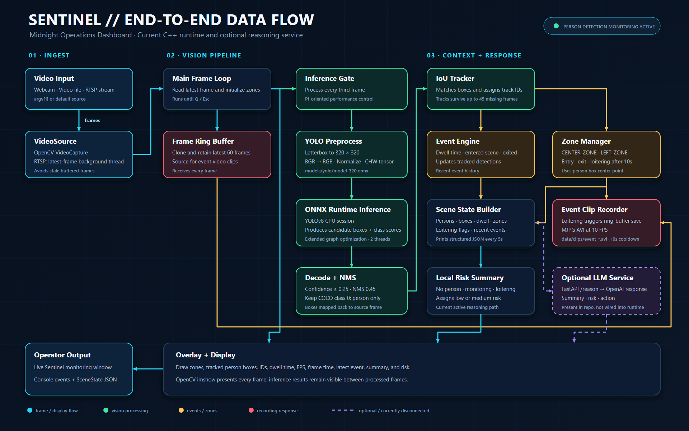

# Sentinel Architecture and Data Flow

Sentinel is a real-time person-monitoring pipeline that ingests webcam, video-file, or RTSP frames; performs person-only YOLOv8 inference; tracks people; evaluates scene and zone events; records loitering clips; and renders an operator-facing OpenCV display.

## End-to-End Data Flow

The diagram uses the **Midnight Operations Dashboard** theme:

- Cyan paths carry frames and display output.
- Green paths represent detection and tracking work.
- Amber paths represent event and zone evaluation.
- Red panels represent recording responses.
- Dashed purple paths are optional components that are present in the repository but are not connected to the current runtime.

## Runtime Flow

1. `main.cpp` chooses the video source and starts `Pipeline`.
2. `VideoSource` opens the webcam, file, or RTSP stream. RTSP capture runs in a background thread and exposes only the newest frame.
3. Every frame enters the main loop and the 60-frame ring buffer.
4. Every third frame is letterboxed to 320 by 320 and passed through the YOLOv8 ONNX model.
5. Post-processing keeps person detections, maps boxes to the original frame, and applies non-maximum suppression.
6. The IoU tracker assigns persistent IDs.
7. `EventEngine` calculates dwell time and emits scene entry and exit events.
8. `ZoneManager` detects zone entry, exit, and loitering. Loitering triggers an event clip save.
9. `SceneStateBuilder` creates structured JSON from people, zones, dwell times, flags, and recent events.
10. The active pipeline generates a local risk summary and renders the final overlay.

## Optional Reasoning Service

`llm_service/` is a provider-neutral FastAPI sidecar. It currently ships with a
deterministic `mock` provider that validates the service contract without API
keys or network access. The service exposes:

- `POST /reason` for one provider inference.
- `POST /benchmark` for repeated, comparable provider runs.
- `GET /providers` for provider and model discovery.
- `GET /health` for service readiness.

Each successful response includes the summary, risk level, recommended action,
provider, model, and request latency. OpenAI-compatible model profiles can be
configured without changing application code. The benchmark endpoint returns
individual runs plus per-model success rate, average/minimum/maximum latency,
and risk-level counts.

Sentinel asynchronously queues a SceneState when loitering is detected. Queue
writes occur inside the vision process, but provider requests run in a
background worker owned by the reasoning sidecar. The worker persists its
queue offset, falls back to `mock` when the selected provider fails, and writes
results for dashboard ingestion. Provider latency cannot block capture or
inference.

`src/reasoning/llm_client.*` is the earlier Windows-only synchronous prototype
and remains outside the CMake target.

## Key Outputs

- Live OpenCV monitoring window
- Console event messages
- Scene-state JSON printed every five seconds
- Loitering-triggered clips under `data/clips/`
